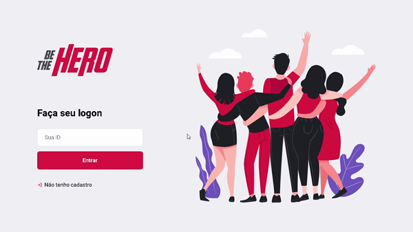
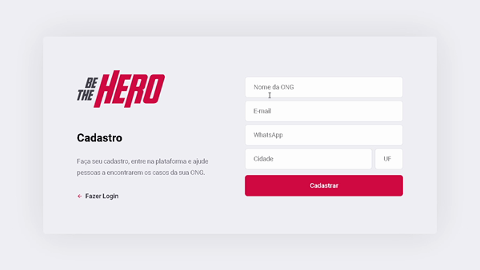
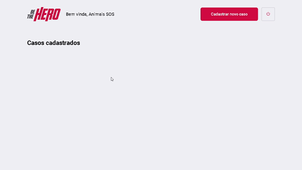

<h1 align="center">
  
</h1>

<strong>🦸‍♀️ Be The Hero's goal is to connect people to NGOs who need help.</strong> Developed at OmniStack#11 Practical project for study

  
  
  
  
  

 

<h2>
  📋 Table of contents
</h2>
<ul>
  <li><a href="https://github.com/Silvio-Ronaldo/beTheHero#-status">Status</a></li>
  <li><a href="https://github.com/Silvio-Ronaldo/beTheHero#%EF%B8%8F-demonstration">Demonstration</a></li>
  <li><a href="https://github.com/Silvio-Ronaldo/beTheHero#%EF%B8%8F-running-locally">Running Locally</a></li> 
  <ul>
    <li><a href="https://github.com/Silvio-Ronaldo/beTheHero#-running-the-backend-server">Running Backend Server</a></li>  
    <li><a href="https://github.com/Silvio-Ronaldo/beTheHero#%EF%B8%8F-running-the-react-app">Running React App</a></li>
    <li><a href="https://github.com/Silvio-Ronaldo/beTheHero#-running-the-mobile-app">Running Mobile App</a></li> 
  </ul>
  <li><a href="https://github.com/Silvio-Ronaldo/beTheHero#%EF%B8%8F-technologies">Technologies</a></li>
  <li><a href="https://github.com/Silvio-Ronaldo/beTheHero#-author">Author</a></li>
  <li><a href="https://github.com/Silvio-Ronaldo/beTheHero#%EF%B8%8F-license">License</a></li>
</ul> 

<h2>📌 Status</h2>
<h4 align="center">🦸‍♀️ Be The Hero is complete. 🚀</h4> 

<h2>🖥️ Demonstration</h2>
<h3>Web Layout</h3>
  

    
  
 
  
<h3>ONG Register</h3>
  

    
  
 
  
<h3>New Case</h3>
  

    
  
 
  
<h3>Mobile</h3>
  

    
  
 

<h2>🕹️ Running locally</h2>
<h3>Prerequisites</h3>
<ol>
  <li><strong>Installing Git:</strong> You need to have Git on your machine to perform a few steps. To download Git, click <a href="https://git-scm.com/downloads">here.</a></li> 
  <li><strong>Installing Node:</strong> To run the server you will need Node.js, to download it, click <a href="https://nodejs.org/en/">here.</a></strong></li> 
  <li><strong>Installing Expo:</strong> To run the mobile, you need to install the Expo, click <a href="https://docs.expo.io/get-started/installation/">here.</a></li> 
  <li><strong>Installing Yarn 1:</strong> Yarn is a package manager that you can download directly from the website by clicking <a href="https://classic.yarnpkg.com/en/docs/install#windows-stable">here.</a> If you prefer, use the NPM.</li> 
  <li><strong>Code Editor (optional):</strong> Make sure you have a code editor of your choice. I recommend using the VS Code. If you need to, download it <a href="https://code.visualstudio.com/Download">here.</a></li>
</ol> 

<h3>🎲 Running the backend server</h3>
<ol>
  <li>In a terminal, clone this repository:
    
<code>git clone https://github.com/Silvio-Ronaldo/beTheHero.git</code>

  </li>
  <li>Enter the project folder:
    
<code>cd beTheHero</code>

  </li>
  <li>Enter the server folder:
    
<code>cd backend</code>

  </li>
  <li>Install all dependencies:
    
<code>yarn install</code> or <code>yarn</code>

  </li>
  <li>Start the database with Knex migrations:
    
<code>yarn knex migrate:latest</code>

  </li>
  <li>Start the development server:
    
<code>yarn start</code>

  </li>
  <li>After these steps, the server should start at the <strong>3333</strong> port.</li>
  <li>If you want to run the tests, do:
    
<code>yarn test</code>

  </li>
</ol> 

<h3>⚛️ Running the React app</h3>
<ol>
  <li>If you have already cloned the repository, proceed, otherwise, see step 1 in 'Running the backend server'</li>
  <li>Enter the project folder:
    
<code>cd beTheHero</code>

  </li>
  <li>Enter the web folder:
    
<code>cd frontend</code>

  </li>
  <li>Install all dependencies:
    
<code>yarn install</code> or <code>yarn</code>

  </li>
  <li>Start the web development server:
    
<code>yarn start</code>

  </li>
  <li>After these steps, the server should start at the <strong>3000</strong> port, open the browser and access <a href="http://localhost:3000">http://localhost:3000</a>.</li>
</ol> 

<h3>📱 Running the Mobile app</h3>
<ol>
  <li>With the Expo installed, according to the documentation, follow</li>
  <li>Enter the project folder:
    
<code>cd beTheHero</code>

  </li>
  <li>Enter the mobile folder:
    
<code>cd mobile</code>

  </li>
  <li>Install all dependencies:
    
<code>yarn install</code> or <code>yarn</code>

  </li>
  <li>Start the mobile development server:
    
<code>yarn android</code> or <code>yarn ios</code> according to your emulator / device.

  </li>
  <li>After these steps, the mobile application must start on your emulator or on your device, according to your choice.</li>
</ol> 

<h2>🛡️ Technologies</h2>

The following tools were used in the development of the project: 

<h3>Backend</h3>
<ul>
  <li><a href="https://nodejs.org/en/">Node</a></li>
  <li><a href="http://knexjs.org">Knex</a></li>
  <li><a href="https://expressjs.com/pt-br/">Express</a></li>
  <li><a href="https://github.com/arb/celebrate">Celebrate</a></li>
  <li><a href="https://www.sqlite.org/index.html">SQLite</a></li>
  <li><a href="https://www.npmjs.com/package/cors">Cors</a></li>
</ul> 

<h3>Web</h3>
<ul>
  <li><a href="https://pt-br.reactjs.org">React</a></li>
  <li><a href="https://react-icons.github.io/react-icons/">React Icons</a></li>
  <li><a href="https://github.com/axios/axios">Axios</a></li>
</ul> 

<h3>Mobile</h3>
<ul>
  <li><a href="https://reactnative.dev">React Native</a></li>
  <li><a href="https://expo.io">Expo</a></li>
  <li><a href="https://docs.expo.io/versions/latest/sdk/mail-composer/">expo-mail-composer</a></li>
  <li><a href="https://reactnavigation.org">React Navigation</a></li>
  <li><a href="https://github.com/software-mansion/react-native-reanimated">React Native Reanimated</a></li>
</ul> 

<h2>👽 Author</h2>
<table>
  <tr>
    <td align="center"><a href="https://github.com/Silvio-Ronaldo"> <b>Silvio Ronaldo</b></a> <a href="https://github.com/Silvio-Ronaldo" title="Silvio Ronaldo">🍀</a></td>
  </tr>
</table>

Leave your star, fork the project or open a pull request ❤️

Contact me on social networks: 

 

<h2>⚖️ License</h2>

<strong>Be The Hero is MIT licensed, as found in the <a href="./LICENSE">LICENSE file</a>.</strong>

